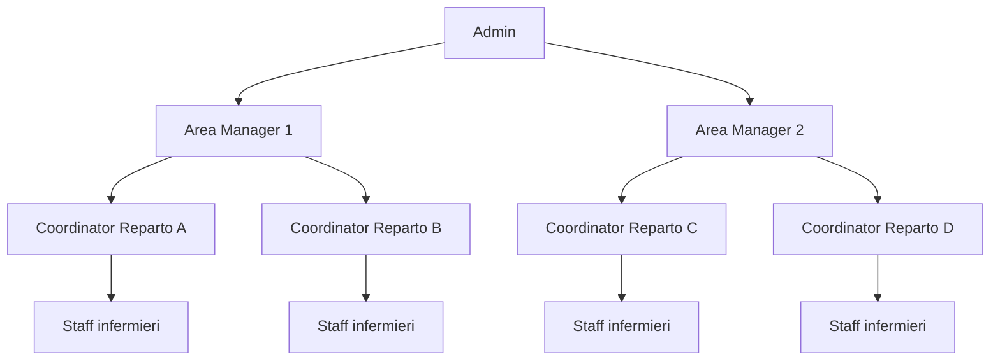
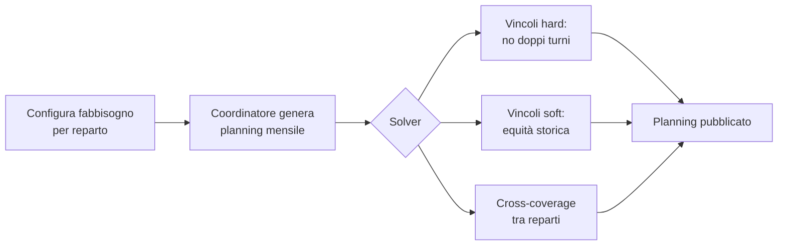

# OPBGestionale — Presentazione per il Responsabile

## Slide 1: Cos'è OPBGestionale

Sistema digitale per la **gestione turni infermieristici** in struttura ospedaliera multi-reparto.

**Obiettivo principale**: automatizzare la pianificazione, garantire la copertura dei turni e rispettare l'equità di carico tra il personale.

---

## Slide 2: Gerarchia dei ruoli



| Ruolo | Ambito | Funzione principale |
|---|---|---|
| **Admin** | Tutto il sistema | Crea utenti, aree, reparti |
| **Area Manager** | Più reparti | Supervisiona copertura e risolve scoperture |
| **Coordinator** | Un reparto | Configura turni e genera planning |
| **Staff** | Se stesso | Visualizza turni e richiede permessi |

---

## Slide 3: Flusso di generazione del planning



---

## Slide 4: Il gap-filler dell'Area Manager

```mermaid
flowchart TD
    A[Planning generato<br/>per i reparti] --> B{Ci sono<br/>scoperture?}
    B -->|Sì| C[Area Manager clicca<br/>"Risolvi scoperture"]
    C --> D[Pool di tutti gli<br/>infermieri dell'area]
    D --> E[Escludi chi è già<br/>assegnato o a riposo]
    E --> F[Ordina per<br/>carico storico]
    F --> G[Assegna i turni<br/>mancanti]
    G --> H{Restano<br/>scoperture?}
    H -->|No| I[Area coperta]
    H -->|Sì| L[Segnala al<br/>responsabile]
    B -->|No| I
```

---

## Slide 5: Cosa può fare ogni ruolo

### Admin
- Crea utenti, reparti, aree
- Assegna coordinator e area manager
- Vede tutti i planning e tutte le dashboard

### Area Manager
- Vede dashboard con copertura % dei reparti della sua area
- Legge dettaglio scoperture
- Esegue gap-filler (reale o simulato)

### Coordinator
- Gestisce il personale del proprio reparto
- Configura fabbisogno e modalità turni
- Genera il planning mensile
- Approva richieste del personale

### Staff
- Consulta il proprio calendario turni
- Richiede ferie, permessi, straordinari
- Vede il proprio bilancio ore

---

## Slide 6: Vantaggi per la struttura

1. **Automazione**: riduzione del tempo di pianificazione manuale
2. **Trasparenza**: ogni ruolo vede solo ciò che gli compete
3. **Equità**: il sistema tiene conto del carico storico
4. **Sicurezza**: vincoli hard impediscono turni illegali (doppi turni, notte-giorno)
5. **Flessibilità**: il gap-filler copre le emergenze tra reparti

---

## Slide 7: Stato di avanzamento

- Backend completo con API REST
- Frontend React funzionante
- Database con gerarchia multi-area
- Test automatizzati: **27/27 superati**
- Codice su GitHub aggiornato

---

## Slide 8: Prossimi passi consigliati

- Test con dati reali della struttura
- Integrazione con sistema presenze/badge
- Notifiche email per richieste e scoperture
- Report mensile exportabile (PDF/Excel)

---

## Credenziali di test

| Ruolo | Username | Password |
|---|---|---|
| Admin | `admin` | `Admin1234!` |
| Coordinator | `coordinator` | `Admin1234!` |
| Coordinator test | `coord_test` | `Test1234!` |
